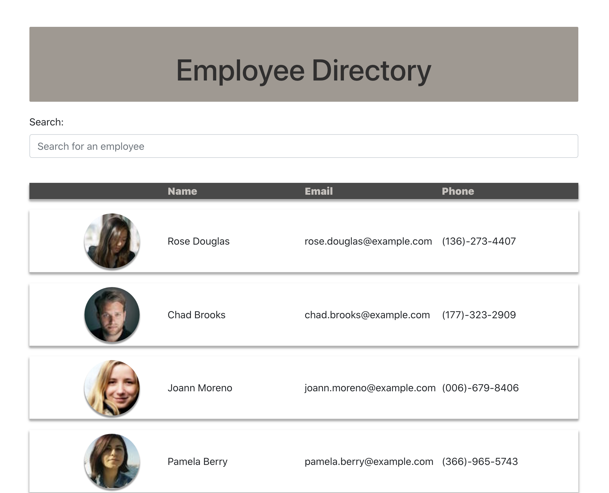

# Employee-Directory

## Table of Contents
 
* [Github Repository](https://github.com/drowekorte/employee-directory) 
* [Links](#links)
* [Technology Used](#technology-used)
* [Mockups and Screenshots](#mockups-and-screenshots)
* [Questions](#questions)
* [Credits](#credits)

## Description
 
Use this directory built with React.js to easily search for employees in you company. 
  

## Deployed App
 
* [Netlify App](https://brave-bassi-c8d247.netlify.app/)
 
  
## Technology Used
 
React.js 
HTML
CSS
JavaScript
ESLint
Bootstrap
3rd party API
  
## Screenshot

## Questions
 
If you have any questions about this project, or happen to use this project, please reach out!

Email: drowekorte@gmail.com
 
Github: [@drowekorte](https://github.com/Drowekorte)
)
 
